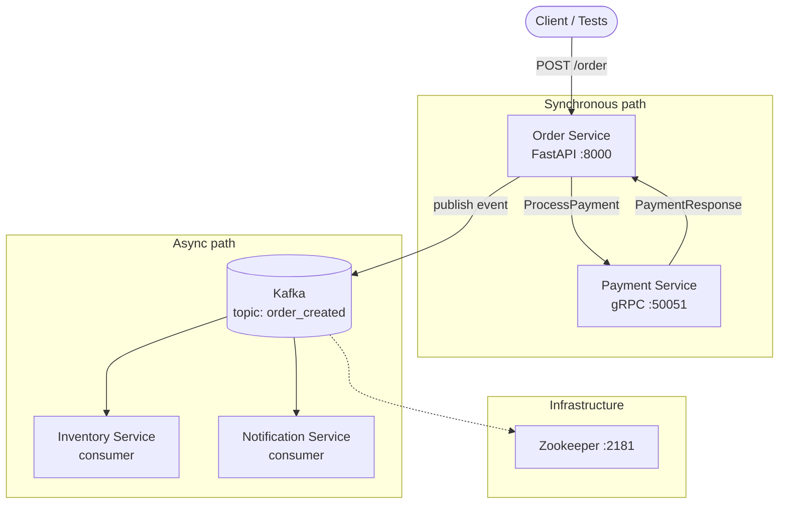
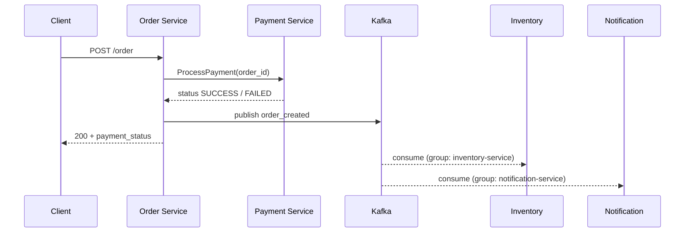

# Architecture

Portfolio project is a small event-driven microservices stack used to demonstrate API testing, gRPC calls, and Kafka-based async integration. Services run together via Docker Compose or Kubernetes (see [README.md](../README.md)).

## System overview



| Component | Role | Exposed to host |
|-----------|------|-----------------|
| **Order service** | HTTP API; orchestrates payment and publishes domain events | Yes (8000 Compose / 30080 k8s NodePort) |
| **Payment service** | Synchronous payment decision over gRPC | Compose only (50051) |
| **Inventory service** | Subscribes to order events; logs processing (placeholder) | No |
| **Notification service** | Subscribes to order events; logs notifications (placeholder) | No |
| **Kafka + Zookeeper** | Event bus and coordination | Compose only (9092 / 2181) |

## Repository layout

```
PortfolioProject/
├── services/
│   ├── order_service/       # FastAPI + Kafka producer + gRPC client
│   ├── payment_service/     # gRPC server (proto in proto/)
│   ├── inventory_service/   # Kafka consumer
│   └── notification_service/
├── docker/docker-compose.yml
├── k8s/                     # Manifests (namespace: portfolio)
├── tests/                   # Pytest integration tests
└── framework/               # Shared test constants (legacy)
```

## Order creation flow

`POST /order` is the main business flow:

1. **HTTP request** hits the order service (`/order`).
2. **gRPC call** — order service opens an insecure channel to payment service and calls `ProcessPayment` with `order_id` (currently hardcoded `"123"`; `amount` defaults to `0` in protobuf).
3. **Payment decision** — payment service returns `SUCCESS` if `amount <= 1000`, otherwise `FAILED`.
4. **Event publish** — order service sends a JSON message to Kafka topic `order_created` with `order_id` and payment `status`.
5. **HTTP response** — caller receives `order_id` and `payment_status`.
6. **Async consumers** — inventory and notification services (separate consumer groups) read the same topic and log messages.



On startup, the order service also ensures the Kafka topic exists (creates `order_created` with 1 partition / replication factor 1, retrying until Kafka is reachable).

## Event contract

**Topic:** `order_created` (configurable via `KAFKA_TOPIC_ORDER`)

**Payload** (JSON, UTF-8):

```json
{
  "order_id": "123",
  "status": "SUCCESS"
}
```

`status` mirrors the gRPC `PaymentResponse.status` string (`SUCCESS` or `FAILED`).

Inventory and notification services use **different consumer groups** (`inventory-service`, `notification-service`), so each receives a copy of every message for independent processing.

## gRPC API (payment)

Defined in `services/payment_service/proto/payment.proto`:

| RPC | Request | Response |
|-----|---------|----------|
| `ProcessPayment` | `order_id` (string), `amount` (double) | `status` (string) |

Transport: plaintext gRPC on port **50051** (no TLS in this demo).

## Configuration

Services read environment variables at runtime (defaults match Docker Compose DNS names):

| Variable | Used by | Default (Compose) | Kubernetes (ConfigMap) |
|----------|---------|-------------------|-------------------------|
| `KAFKA_BOOTSTRAP_SERVERS` | order, inventory, notification, tests | `kafka:9092` | `kafka-broker:9092` |
| `KAFKA_TOPIC_ORDER` | all Kafka clients | `order_created` | `order_created` |
| `PAYMENT_GRPC_TARGET` | order service | `payment_service:50051` | `payment-service:50051` |
| `ORDER_SERVICE_URL` | tests | `http://order_service:8000` | `http://order-service:8000` |

Kubernetes uses hyphenated service names because DNS labels cannot contain underscores, and a Service named `kafka` would inject `KAFKA_PORT` and crash the Confluent image — hence the broker Service is named **`kafka-broker`**.

## Deployment topologies

### Docker Compose

- All services on one Docker network; hostnames are service names (`kafka`, `payment_service`, `order_service`).
- Order API published on **localhost:8000**.
- Defined in `docker/docker-compose.yml`.

### Kubernetes

- Namespace: `portfolio`.
- Order API exposed via **NodePort 30080** (or `kubectl port-forward`).
- Payment and Kafka are cluster-internal only.
- Applied with `kubectl apply -k k8s/`.

Details and commands: [README.md](../README.md).

## Testing

| Layer | Location | What it covers |
|-------|----------|----------------|
| Health | `tests/api/test_health.py` | `GET /health` |
| E2E flow | `tests/test_order_flow.py` | `POST /order` + Kafka event assertion (`status == SUCCESS`) |
| Utilities | `tests/utils/kafka_helper.py`, `tests/clients/order_client.py` | Polling Kafka, HTTP client |

Tests run in a container (`tests` Compose service or optional `tests-job.yaml` in k8s) with env pointing at the order service and Kafka bootstrap servers.

See also [testing_notes.md](testing_notes.md) for risks and strategy direction.

## Design notes and limitations

Current implementation is intentionally minimal for learning and test automation:

- **Hardcoded order** — `order_id` is always `"123"`; request body is not used.
- **Payment amount** — not sent from order service, so payment always sees `amount = 0` and returns `SUCCESS`.
- **No persistence** — no databases; consumers only log events.
- **No idempotency** — duplicate `POST /order` calls would publish duplicate events.
- **No dead-letter or retry policy** beyond client-side reconnect loops in consumers.
- **Plaintext only** — no mTLS or auth between services.

### Testing challenges (target areas for expansion)

- Kafka message delivery and consumer lag under load
- Duplicate events and idempotent handlers
- gRPC failures (payment down, timeouts, wrong status)
- Eventual consistency between HTTP response and consumer side effects
- Failure injection across Compose vs Kubernetes networking

## HTTP surface (order service)

| Method | Path | Description |
|--------|------|-------------|
| `GET` | `/health` | Liveness/readiness probe; `{"status":"ok"}` |
| `POST` | `/order` | Run payment + publish event; returns order and payment status |
